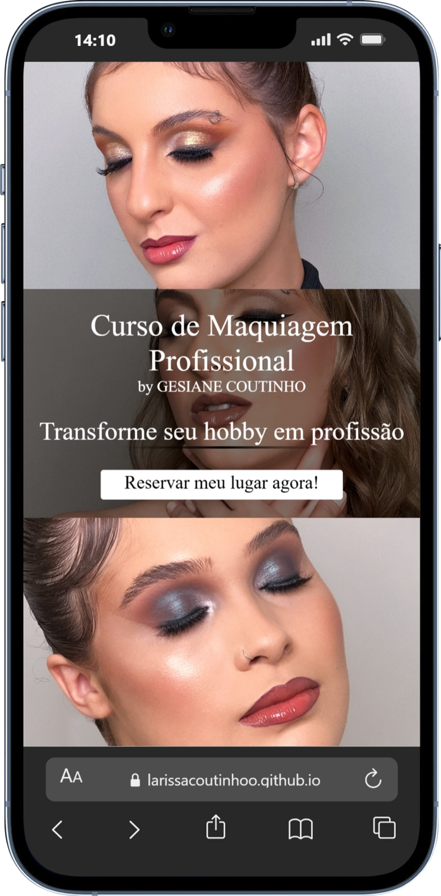
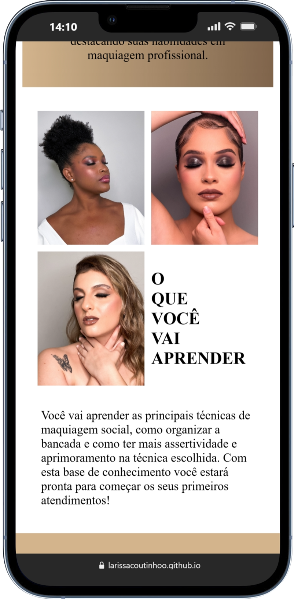
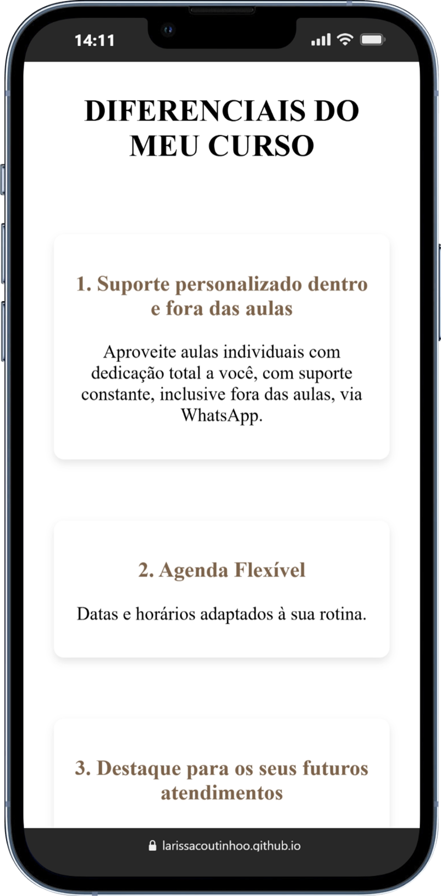
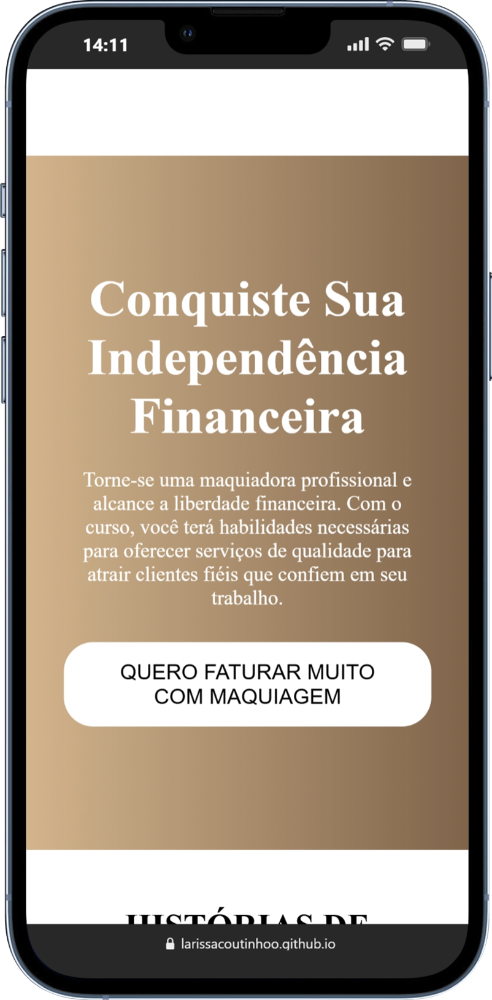
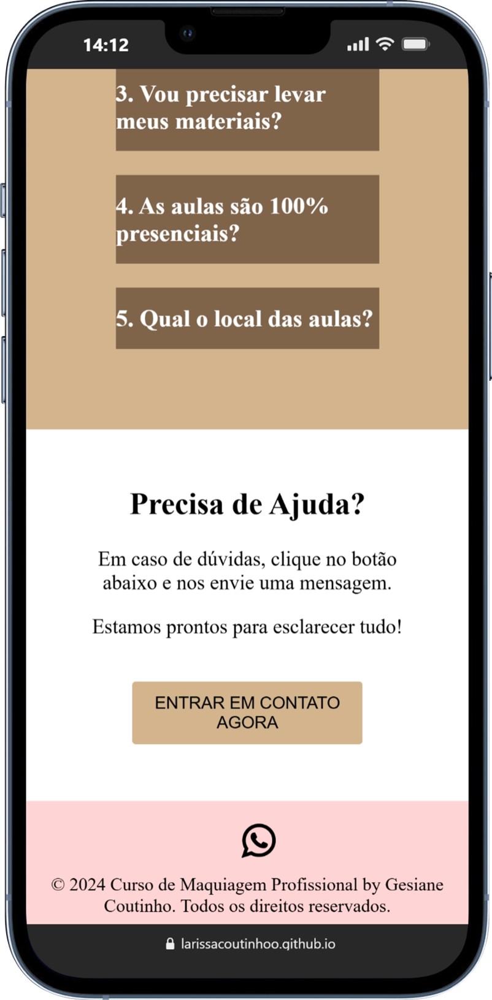

## 🌐 Link do site
https://larissacoutinhoo.github.io/apresentacaoCursoMaquiagem/

## 📱 Prévia do Site (Mobile)
Aqui estão algumas capturas reais do layout visto no celular:

  
  
  
  
  

> *As imagens mostram partes essenciais das principais seções da página.*

## Sobre o projeto
Este projeto é um site de apresentação criado para divulgar um curso de maquiagem profissional. O objetivo principal é fornecer informações detalhadas sobre o curso, apresentar seus benefícios e facilitar o processo de inscrição, que é realizado diretamente pelo WhatsApp.

## Funcionalidades
Apresentação clara do curso e seus diferenciais

Layout responsivo, adaptado para dispositivos móveis

Botão de inscrição via WhatsApp

## Tecnologias utilizadas
HTML5

CSS3

JavaScript (se aplicável)

## 💌 Contato
Para dúvidas ou sugestões, sinta-se à vontade para entrar em contato.
